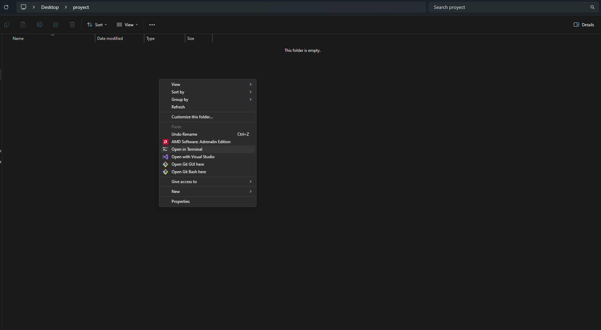

# sender-python

## Descripción
Este es un proyecto académico para la UADE, un paquete que permite la comunicación entre los distintos módulos a través del Core.

## Tabla de Contenidos
- [Instalación](#instalación)
- [Uso](#uso)
- [Ejemplo](#ejemplo)

## Instalación
Para instalar el paquete abrí una terminal en el directorio del proyecto (Shift + Click derecho)..


..y escribí:
```bash
pip install Squad1CoreSender
```

## Uso
Usá el paquete de la siguiente manera:
1. Iniciá dos conexiones con el servidor, una será para enviar mensajes y la otra para recibirlos. 
La conexión te va a pedir especificar un host, un puerto, un usuario y una contraseña. Todos los datos te van a ser dados por el Squad del Core.
2. Definí una función de callback, o sea lo que va a hacer tu aplicación cada vez que reciba un mensaje. Esto te va a permitir procesarlo.
Es importante aclarar que los mensajes viajan en formato de bytes[] así que será necesario usar decode.
3. Iniciá el servicio consumidor dándole una conexión e indicándole cuál es tu módulo, el cual estará restringido por el enum Modules.
Es importante aclarar que invocar a esta función bloqueará un hilo de procesamiento para estar permanentemente a la escucha.
4. Por último, podés usar el método publish para enviar mensajes a cualquier módulo válido. También se encuentra restringido por el enum Modules.
Necesitarás ingresar por parámetro una conexión (distinta a la del servicio consumidor), el mensaje en formato String, el nombre del módulo de origen, el de destino y el caso de uso que genera al mensaje.
Recomendamos cerrar la conexión usada después de enviar un mensaje, o un lote de ellos, y abrir una nueva cuando vuelva a ser necesaria.


> [!CAUTION]
> ACLARACIONES
> 1. Tené en cuenta que la conexión es un objeto del tipo AutoCloseable, por lo que deberías manejar las excepciones e implementar una lógica de reconexión.
> 2. Los mensajes pueden ser clases convertidas a un String de formato JSON ó valores sueltos en forma de Plain String. Nuestra recomendación es usar clases, como la vista de ejemplo, para un mejor manejo de la información.


## Ejemplo
```Python
import json
import os

import sender
from sender import *

from Usuario import Usuario

pool_connections = []

#Abro tantas conexiones como quiera.
for i in range(2):
    pool_connections.append(
        start_connection(
            os.getenv('HOST'),
            os.getenv('PORT'),
            os.getenv('USER'),
            os.getenv('PASSWORD')
        )
    )


def new_callback(ch, method, properties, body):
    #Este sería el JSON que encapsula a los datos enviados desde el módulo de origen.
    message = convert_body(body)

    #Estos serían los datos enviados desde el módulo de origen.
    payload = message.get('payload')

    try:
        #Si los datos pertenecen a una clase podés convertirlos a un objeto genérico de Python.
        usuario = convert_payload(payload)

    except Exception as e:
        pass


#Esta línea es esencial para el funcionamiento del servicio consumidor.
sender.callback = new_callback

start_consumer(pool_connections[0], Modules.USUARIO.value)

#Creo un usuario de prueba (es necesario que exista la clase con su función .__init__())
usuario = Usuario(nombre='Matias')

#Convierto el usuario en un String con formato de JSON (es necesario que exista la clase con su método .to_dict())
mensaje = convert_class(usuario)

publish(pool_connections[1], mensaje, Modules.USUARIO.value, Modules.USUARIO.value, 'Prueba')

close_connection(pool_connections[1])

```

### Clase de prueba
```Python
class Usuario:
    def __init__(self, nombre):
        self.nombre = nombre

    def to_dict(self):
        return {
            "nombre": self.nombre
        }

```
